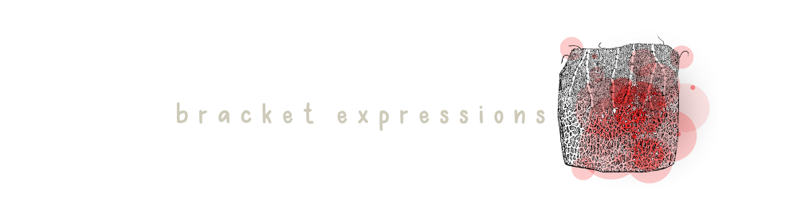

[](https://canva.com/)
[](https://canva.com/)

[](https://canva.com/)

### 

  - [OVERVIEW](#overview)
  - [REGEX COMPONENTS](#regex)
    - [*anchors*](#anchors)
    - [*quantifiers*](#quantifiers)
    - [*grouping constructs*](#grouping)
    - [*bracket expressions*](#bracket)
    - [*character classes*](#classes)
    - [*the or operator*](#operator)
    - [*flags*](#flags)
    - [*character escapes*](#escapes)
  - [SOURCES](#sources)
  - [CONNECT](#connect)


**AUTOPSY FILES** is here to dissect a variety of *REGEX expressions* to help you understand, and breakdown, each component.
*REGEX expressions* - or [Regular Expressions](https://developer.mozilla.org/en-US/docs/Web/JavaScript/Guide/Regular_expressions) - is an exceptionally useful sequence of characters that specifies a match pattern in text. 

#
> It will accept a certain set a strings that match the pattern, and will reject the rest.
#

### 

There are a variety of important parts to every *REGEX expression*. We will be covering each portion in detail for the expressions below:


*REGEX expression* that checks for hex values
```javascript
const regex = /^#?([a-f0-9]{6}|[a-f0-9]{3})$/;
```

*REGEX expression* that checks for all character values, including defined special characters
```javascript
const regex = /^[a-zA-Z0-9!@#$%\^&*)(+=._-]*$/;
```

*REGEX expression* that checks the validity of a phone number
```javascript
const regex = /^(?:\d{3}|\(\d{3}\))([-.])\d{3}\1\d{4}$/;
```

#### 

Anchors are used at the start and end of the *REGEX expression* string, and describe the position of the expression in a line of text. Anchors are comprised of the **caret `^`** and **dollar `$`** symbol.

>The `^` symbol designates match start & the `$` symbol designates match end.

Each *REGEX expression* below is defined by both the caret and dollar symbol, stating the beginning and end of each particular string.

##### hex value
```javascript
/^   #?([a-f0-9]{6}|[a-f0-9]{3})   $/
```

##### character value
```javascript
/^   [a-zA-Z0-9!@#$%\^&*)(+=._-]*   $/
```

##### phone number
```javascript
/^   (?:\d{3}|\(\d{3}\))([-.])\d{3}\1\d{4}   $/
```

###### We inspect the innards of each *REGEX expression* in the coming sections!

#### 

Quantifiers are used within the *REGEX expression* to dictate how many characters are expected within the string of text, and details how many instances the character(s) must be present for match.

* The optional symbol `?` informs that the proceeding character may, or may not, be present in the string for match.
* The curly braces `{..}` orders a match of the proceeding character(s) for as many times defined inside the bracket.
* The asterick symbol `*` orders a match of the preceding character(s) for 0 or more times (until infinity & beyond). This symbol is considered a *repeater*.

##### hex value *quantifiers* include: `?`, `{6}`, `{3}`
```javascript
/^#  ?  ([a-f0-9]  {6}  |[a-f0-9]  {3}  )$/
```
##### character value *quantifier*: `*`
```javascript
/^[a-zA-Z0-9!@#$%\^&*)(+=._-]  *  $/
```
##### phone number *quantifiers* include: `?`, `{3}`, `{4}`
```javascript
/^(  ?  :\d {3} |\(\d {3} \))([-.])\d {3} \1\d  {4}  $/
```

#### 

#### 

#

### 

1. [Wikipedia](https://en.wikipedia.org/wiki/Regular_expression)
2. [MDN Web Docs](https://developer.mozilla.org/en-US/docs/Web/JavaScript/Guide/Regular_expressions)
3. [Regular-Expressions](https://www.regular-expressions.info/)
4. [Geeks for Geeks](https://www.geeksforgeeks.org/write-regular-expressions/)

### 

##### `leave a comment!`

[](https://gist.github.com/christiecamp)